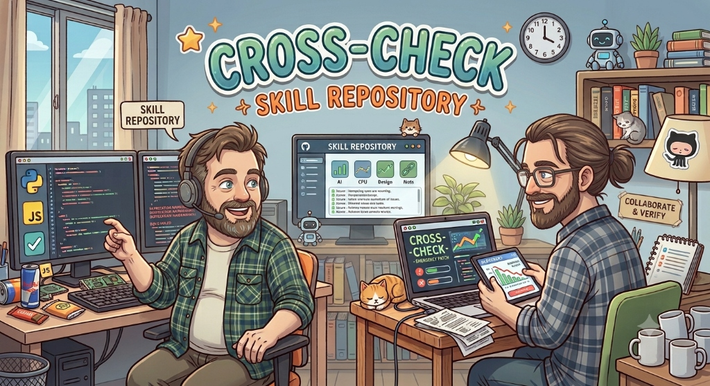

<p align="center">
  
</p>

# 🛡️ cross-check

> **Laser-focused, diff-scoped gatekeeper for enterprise stability, security, and YAGNI.**  
> Built for Claude Code, Codex, Antigravity, and any Agent Skills-compatible AI assistant.

---

## ⚡ Why Cross-Check?

In enterprise software deployed on-premise, defects cannot be silently hot-reloaded. A single memory leak, unhandled panic, or authorization bypass can trigger emergency engineering and compliance escalation.

AI coding agents produce plausible code, but can also introduce:
- **Resource Leaks**: Unclosed files, sockets, database connections, workers, and listeners.
- **Concurrency Hazards**: Races, check-then-act bugs, and lock-order deadlocks.
- **Swallowed Errors**: Lost causes, ignored failures, and broken transaction rollback paths.
- **Contract Drift**: A changed return/error/precondition contract that breaks existing callers.
- **Over-Engineering**: AI-generated abstractions, unnecessary dependencies, and speculative flexibility.

**`cross-check` is not a full-scan SAST.** It is a fast, conservative **post-change safety gate** over your `git diff`, expanding into caller context only when needed to establish blast radius.

---

## 🧭 7 Universal Enterprise Invariants

| Tag | Category | What We Catch |
| :--- | :--- | :--- |
| `leak:` | **Resource Lifecycle** | FD, socket, DB connection, worker/task, listener, and context leaks. |
| `race:` | **Concurrency** | Shared mutable state, non-atomic updates, TOCTOU, lock/deadlock hazards. |
| `npe:` / `crash:` | **Boundary Safety** | Null/nil dereferences, bounds errors, unsafe casts, panic paths. |
| `caller:` | **Blast Radius** | Return/error/precondition/side-effect drift at existing call sites. |
| `swallow:` | **Error Integrity** | Ignored errors, lost causes, uncaught async failures, rollback gaps. |
| `sec:` | **Trust Boundary** | Injection, path traversal, secret/PII exposure, auth/authz bypass. |
| `yagni:` | **Minimalism** | Speculative abstractions, dependency bloat, redundant layers. |

### Evidence-based confidence

Every finding is labeled:

- **HIGH** — directly demonstrated by the diff/context.
- **MEDIUM** — credible, but runtime/framework or unseen-path behavior could change the outcome.
- **LOW** — plausible but not established from available evidence.

LOW-confidence observations never block a review. Language/framework-specific guidance is used to reduce false positives rather than invent defects.

---

## 🚦 Verdicts

| Verdict | Meaning |
| :--- | :--- |
| 🔴 **BLOCKED** | HIGH-confidence production-significant security, crash, leak, race/deadlock, data-corruption, or caller-contract defect. |
| 🟡 **CONDITIONAL PASS** | No HIGH blocker, but a credible MEDIUM-confidence safety/security/stability/contract risk remains. |
| 🟢 **PASS** | No HIGH/MEDIUM safety or security findings. LOW and subjective style findings do not block. |

**YAGNI and style findings cannot block by themselves.**

---

## 📦 Quick Install

### Via `skills.sh` (Recommended)
```bash
npx skills add parkjangwon/cross-check -g
```

### Manual Symlink
```bash
# Claude Code (Global)
mkdir -p ~/.claude/skills
ln -s /path/to/cross-check ~/.claude/skills/cross-check

# Antigravity (AGY)
mkdir -p ~/.gemini/antigravity/skills
ln -s /path/to/cross-check ~/.gemini/antigravity/skills/cross-check
```

---

## 📊 Sample Output

```markdown
# 🛡️ Cross-Check Security & Stability Review

- **Target Scope**: Working Tree (staged + unstaged)
- **Audited Files**: 2 files
- **Scoreboard**: 🚨 1 Critical | ⚠️ 1 Warning | 🧹 1 YAGNI | net: -45 lines possible
- **Confidence**: HIGH 1 | MEDIUM 2 | LOW 1
- **Verdict**: 🔴 BLOCKED

## ⚡ Quick Scan
- `session_manager.go:L42: race: [HIGH] concurrent write to activeSessions map. Protect with sync.RWMutex.`
- `AuthService.java:L89: caller: [MEDIUM] timeout now returns null; caller L91 dereferences it. Guard or preserve the contract.`
- `RuleEngine.ts:L12-70: yagni: [LOW] abstraction appears to have one consumer. Verify DI/test/plugin boundary before removing.`

## 🚨 Critical Issues
### 1. [session_manager.go:L42] Concurrent Map Write Panic
- **Confidence**: HIGH
- **Blast Radius**: High concurrent traffic can trigger a Go runtime panic and terminate the daemon.
- **Conservative Fix**:
```go
m.mu.Lock()
m.activeSessions[id] = session
m.mu.Unlock()
```
```

---

## 💬 Usage

Ask your agent naturally in English or Korean:

- *"Cross-check my uncommitted code for crash risks, leaks, and over-engineering."*
- *"Audit staged changes against enterprise invariants."*
- *"Cross-check commit `a1b2c3d` before merging."*
- *(한국어: "방금 수정한 코드 장애 유발 요인이랑 오버엔지니어링 크로스체크해줘.")*

---

## 🛠️ Standalone CLI (`get_diff_context.py`)

Extract token-efficient, noise-free diffs directly in your terminal:

```bash
python3 scripts/get_diff_context.py
python3 scripts/get_diff_context.py --staged
python3 scripts/get_diff_context.py --commit <HASH>
python3 scripts/get_diff_context.py --range main..HEAD
```

The extractor automatically includes untracked files, filters common generated/binary noise, and can discover candidate caller sites. Caller discovery is intentionally treated as a candidate list; reflection, generated code, dynamic dispatch, and framework wiring may require semantic review.

---

## 🧪 Regression Tests

The extractor has a dependency-free regression suite covering diff filtering, modified-symbol extraction, caller candidates, untracked files, binary exclusion, and source/config boundaries.

```bash
python -m unittest discover -s tests -p 'test_*.py' -v
```

GitHub Actions runs the suite on Python 3.9, 3.11, and 3.13 for every push and pull request. The tests are deliberately focused on the extractor's deterministic behavior; semantic security judgments remain the responsibility of the AI review layer.

---

## 📚 Reference Guides

- `references/enterprise_checklist.md` — universal invariants, confidence policy, and verdict mapping.
- `references/language_guidance.md` — Java/JVM, Go, Rust, C/C++, Python, TypeScript/JavaScript, and framework-aware review guidance.
- `references/report_template.md` — standardized high-density review output.

---

## 📜 License
MIT
